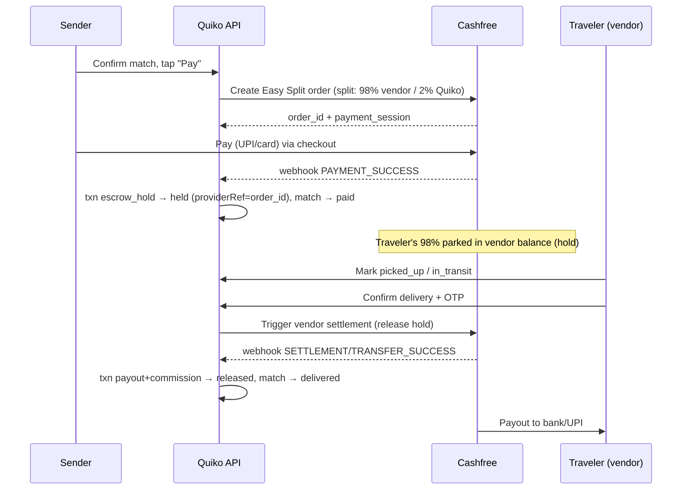

# Quiko — Payments & KYC Migration Plan (Razorpay → Cashfree)

> Status: **Phase 1 server foundation built (behind a flag); simulated stays the
> default.** Decision made: use **Cashfree Easy Split**. This document maps the
> full migration from *simulated* escrow + *manual* KYC to **Cashfree**.
> Last updated: 2026-08-27.
>
> ### Progress
> **Done (server-side, behind `CASHFREE_APP_ID` flag — simulated is default):**
> - `lib/payments.ts` — provider seam (simulated + Cashfree Easy Split), mirrors
>   `lib/otp.ts`. Vendor create, order-with-splits, hold, release, webhook verify.
> - `payForMatch()` / `confirmDelivery()` refactored to route through the provider;
>   external calls made outside DB transactions; status re-checked for concurrency.
> - `app/api/webhooks/cashfree/route.ts` — idempotent webhook (payment→held/paid,
>   settlement→payout released).
> - `profiles.cashfree_vendor_id` column added (migration `0008`).
> - `.env.local` documents the Cashfree vars (commented; unset → simulated).
> - Verified: typecheck clean; simulated pay flow unchanged end-to-end.
>
> **Not done yet (needs sandbox credentials / product decisions):**
> - Traveler **vendor onboarding UI** (collect bank/UPI + PAN → `ensureVendor`).
> - **Client checkout** wiring (web Cashfree JS SDK + mobile RN SDK using
>   `paymentSessionId`).
> - **Verify the exact Easy Split release/settlement endpoint** against sandbox
>   (`releaseToTraveler` is coded to the documented shape but unconfirmed).
> - **Refund / cancellation** path. KYC (Secure ID) — Phase 2, not started.
> - Reconciliation job + `webhook_events` idempotency table.

---

## 1. Decision & rationale

**Chosen direction: adopt Cashfree for (a) marketplace payments/payouts and (b) KYC.**

Why Cashfree fits Quiko specifically:
- **Payouts are its core strength.** Quiko disburses many small amounts to
  *individual* travelers — Cashfree's payout architecture (24×7 instant to
  bank/UPI) is built for exactly this marketplace/gig pattern.
- **KYC is a real product** (Secure ID / Verification Suite): Aadhaar, PAN,
  bank penny-drop, face match + liveness, video KYC. Razorpay does **not** offer
  standalone end-user identity verification — its KYC is only for onboarding
  merchants onto Razorpay. Quiko must verify travelers, so with Razorpay we'd
  need a *second* vendor anyway.
- **Vendor consolidation:** payments + payouts + KYC under one provider = one
  integration surface, one reconciliation, one contract.

### ⚠️ The "escrow" correction (important)
Neither Razorpay nor Cashfree provides **true legal escrow** (a segregated,
RBI-regulated trust account) out of the box. Both provide **split settlement
with hold-and-release**:
- Razorpay → **Route**
- Cashfree → **Easy Split**

Our current flow ("held in escrow, released on OTP delivery") maps onto Easy
Split's *vendor-balance hold + triggered settlement*. This is functionally what
we need, **but** we must not market it to users as legal "escrow" unless we set
up a real bank/trustee escrow (e.g. Castler or a bank escrow account) — that is a
compliance claim. RBI Payment Aggregator rules also bound how long funds can be
held; holding a few days until delivery is fine, indefinite holds are not.

### Advantages of staying on Razorpay (for the record)
- Larger ecosystem, more mature docs/SDKs, easier hiring.
- Route is the most battle-tested split product in India.
- Deeper adjacent suite (RazorpayX banking, payroll) if we scale.
- Zero switching cost — we'd keep the model we already sketched.

**Deciding factors before committing (do these first):**
1. Get **written confirmation** that Cashfree will approve a **P2P peer-delivery
   marketplace** business category (some PAs are cautious with P2P money flow).
2. Get **per-transaction pricing** for our real volumes (avg ticket ~₹200–700,
   payout frequency, KYC volume) — public rates don't reflect marketplace deals.
3. Confirm **max hold duration** allowed on the vendor balance.

---

## 2. How the current system works (baseline)

Money and identity are already abstracted behind a `provider` column, so the
migration is a *provider swap + webhook-driven state*, not a rewrite.

### Payment / escrow lifecycle (all simulated today)
- **Pay in:** `lib/queries/matches.ts → payForMatch()` inserts a
  `transactions` row `{ type: "escrow_hold", status: "held", provider: "simulated" }`
  and moves the match `confirmed → paid`. No real charge.
- **Advance:** `advanceMatchAsTraveler()` `paid → picked_up → in_transit`.
- **Release:** `confirmDelivery()` validates the delivery OTP, then inserts two
  rows — `{ type: "payout", status: "released", toProfile: traveler }` and
  `{ type: "commission", status: "released" }` — using `splitPayment()` from
  `core/pricing.ts` (traveler 98% / Quiko 2%), and moves match `→ delivered`.
- **Wallet:** `getTravelerWallet()` sums `payout` rows (earned) and
  active-carry escrow (pending). Purely derived from `transactions`.

### KYC lifecycle (manual today)
- **Submit:** `lib/queries/kyc.ts → submitKyc()` inserts `kycVerifications`
  `{ status: "pending", provider: "manual" }`.
- **Review:** admin `approveKyc()` / `rejectKyc()` sets `verified`/`rejected`
  and bumps `profiles.kycLevel`. UI: `app/admin/kyc`, `components/KycReviewActions.tsx`.

### Schema already supports the swap
- `transactions`: has `provider` + `providerRef` (`db/schema.ts:216`).
- `kycVerifications`: has `provider` + `providerRef` (`db/schema.ts:95`).
- Enums: `txnTypeEnum` (`escrow_hold`, `payout`, `commission`), `txnStatusEnum`
  (`pending`/`held`/`released`/…), `kycStatusEnum`.

---

## 3. Target architecture



Key principle: **Cashfree is the source of truth for money; our DB mirrors it
via webhooks.** State transitions that today happen synchronously inside a DB
transaction become: *call Cashfree → record pending → confirm on webhook.*

---

## 4. Prerequisites

- [ ] Cashfree **production + sandbox** accounts; business category approved for P2P delivery.
- [ ] Cashfree **Payments/Easy Split** enabled; **Secure ID** (KYC) enabled.
- [ ] API keys: `CASHFREE_APP_ID`, `CASHFREE_SECRET_KEY` (payments),
      Secure ID client credentials, and **webhook signing secret**.
- [ ] A **public HTTPS webhook URL** (prod domain; use a tunnel like ngrok for local).
- [ ] Legal: update Terms/Privacy re: how funds are held & released; drop/adjust
      any literal "escrow" wording unless real escrow is set up.

### Environment variables (add to `quiko-app/.env`)
```
CASHFREE_ENV=sandbox            # sandbox | production
CASHFREE_APP_ID=...
CASHFREE_SECRET_KEY=...
CASHFREE_WEBHOOK_SECRET=...
CASHFREE_SECURE_ID_CLIENT_ID=...
CASHFREE_SECURE_ID_CLIENT_SECRET=...
CASHFREE_RETURN_URL=https://<app>/app/matches   # post-payment redirect
```

---

## 5. Phase 1 — Payments & payouts (Easy Split)

### 5.1 New provider module
- `lib/payments/cashfree.ts` — thin server-only client: create order, create/lookup
  vendor, trigger settlement, verify webhook signature. Keep it framework-agnostic
  so mobile API + web share it.

### 5.2 Traveler = "vendor" onboarding
Easy Split settles to **vendor accounts**, so each traveler who wants to earn must
be registered as a Cashfree vendor with a **bank account or UPI + PAN**.
- Add a `vendorId` (Cashfree vendor ref) to `profiles` (new column) — or a small
  `payout_accounts` table if a user can have multiple.
- New flow in `app/app/profile` (or a dedicated "Get paid" screen): collect
  bank/UPI + PAN, call Cashfree create-vendor, store `vendorId`.
- Block delivery-release for travelers without a verified vendor account.

### 5.3 Pay-in (replaces `payForMatch`)
- `payForMatch()` becomes: create Easy Split **order** with the split defined
  (`travelerEarns` → traveler vendor, `commission` → Quiko), amount from
  `m.agreedPrice`. Return `payment_session_id` to the client.
- Insert `transactions` `{ type: "escrow_hold", status: "pending", provider: "cashfree", providerRef: order_id }`.
- **Do not** flip match → `paid` yet. Wait for webhook.
- Client: open Cashfree checkout (web SDK / mobile). Entry points to change:
  `app/api/matches/[id]/pay/route.ts`, web `MatchFlow.tsx`, mobile `api.payForMatch`.

### 5.4 Webhook handler (new)
- `app/api/webhooks/cashfree/route.ts` — verify signature, handle:
  - `PAYMENT_SUCCESS` → `escrow_hold` `pending → held`, match `confirmed → paid`,
    notify traveler. (This is the code currently at the end of `payForMatch`.)
  - `PAYMENT_FAILED` → mark failed, surface to sender.
  - `SETTLEMENT/TRANSFER_SUCCESS` → `payout`/`commission` `pending → released`.
  - `TRANSFER_FAILED` → alert + retry queue.
- **Idempotency:** dedupe by Cashfree event id; use `providerRef`. Webhooks can
  arrive more than once and out of order.

### 5.5 Release on delivery (modify `confirmDelivery`)
- Keep the OTP check exactly as-is (`m.deliveryOtp`).
- Instead of inserting `released` rows directly, **call Cashfree** to release the
  vendor hold / trigger settlement, and insert `payout`+`commission` as
  `pending`. Flip to `released` on the settlement webhook.
- Match → `delivered` can still happen on OTP success (delivery is confirmed);
  only the *money* waits on the webhook. Wallet "pending → earned" flips on webhook.

### 5.6 Refunds / cancellations
- Add a cancel path: if a match is cancelled before delivery, refund the sender
  via Cashfree (order refund) and mark `escrow_hold` reversed. Not in the current
  simulated flow — **new** work, needed for real money.

---

## 6. Phase 2 — KYC (Secure ID)

### 6.1 Replace manual review with API verification
- `submitKyc()` (currently `provider: "manual"`, status `pending`) becomes a call
  to Cashfree Secure ID:
  - **Aadhaar** (OKYC/DigiLocker or OCR), **PAN**, **bank penny-drop** (reuse for
    vendor payout account), optional **face match + liveness** / **video KYC** for
    higher trust tiers.
- On a passing response → set `kycVerifications.status = verified`,
  `provider = "cashfree"`, `providerRef = <verification id>`, and bump
  `profiles.kycLevel` **automatically** (no admin step).
- On failure/ambiguous → keep `pending` and fall back to the existing admin
  review UI (`app/admin/kyc`) — so the manual path stays as a safety net.

### 6.2 Tie KYC tiers to capability
- Map `kycLevel` to what a user can do (e.g. carry value caps, payout eligibility).
  `confirmDelivery` release should require the traveler to be KYC-verified.
- `trustScore` calc in `rateTraveler()` already reads `kycLevel` — keep.

### 6.3 UI
- `components/KycForm.tsx` + `app/app/verify` → show live verification steps and
  instant result instead of "submitted for review".

---

## 7. File-level change map

| Area | File(s) | Change |
|---|---|---|
| Provider client | `lib/payments/cashfree.ts` *(new)* | Orders, vendors, settlements, webhook verify |
| Secure ID client | `lib/kyc/cashfree.ts` *(new)* | Aadhaar/PAN/bank/face verify calls |
| Pay-in | `lib/queries/matches.ts::payForMatch` | Create order, insert `pending`, don't flip status |
| Release | `lib/queries/matches.ts::confirmDelivery` | Trigger settlement, insert `pending` payout/commission |
| Webhooks | `app/api/webhooks/cashfree/route.ts` *(new)* | Drive `held`/`released` + status transitions |
| Pay API | `app/api/matches/[id]/pay/route.ts` | Return `payment_session_id` instead of `{ok}` |
| KYC submit | `lib/queries/kyc.ts::submitKyc` | Call Secure ID, auto-verify |
| KYC UI | `components/KycForm.tsx`, `app/app/verify` | Live verification UX |
| Vendor onboarding | `profiles` schema + profile UI | Collect bank/UPI+PAN → Cashfree vendor, store `vendorId` |
| Checkout (web) | `components/MatchFlow.tsx` | Open Cashfree checkout with session |
| Checkout (mobile) | `quiko-mobile/lib/api.ts` + match screen | Cashfree RN checkout |
| Config | `quiko-app/.env`, `lib/env` | New env vars above |

**No change needed** to `core/pricing.ts::splitPayment` (2% commission math is
provider-agnostic) or the wallet aggregation logic — only *when* rows flip to
`released` changes.

---

## 8. Data model changes (minimal)
- `profiles`: add `cashfreeVendorId text` (or new `payout_accounts` table).
- `transactions`: no schema change — start using `status: "pending"` before
  webhook confirmation, and set `provider="cashfree"`, `providerRef=<id>`.
- `kycVerifications`: no schema change — `provider="cashfree"`, `providerRef`.
- Consider a `webhook_events` table (event id, type, payload, processed_at) for
  idempotency + audit.

---

## 9. Cross-cutting concerns
- **Idempotency:** every webhook handler keyed by Cashfree event id.
- **Reconciliation:** nightly job comparing our `transactions` vs Cashfree
  settlement report; flag mismatches.
- **Security:** verify webhook signatures; never trust client-reported payment
  success; keep secrets server-only.
- **Money rounding:** amounts are integer paise/rupees — keep `Math.round` on
  `splitPayment` consistent with what we send Cashfree, or splits won't reconcile.
- **Failure UX:** payment failed, payout failed, KYC failed — each needs a user
  message and a retry/support path.

---

## 10. Testing
- Cashfree **sandbox** end-to-end: order → success webhook → hold → delivery →
  settlement webhook → payout; plus failed-payment and refund paths.
- Local webhooks via tunnel (ngrok) → `/api/webhooks/cashfree`.
- KYC sandbox: Aadhaar/PAN/bank pass + fail cases; confirm `kycLevel` bump.
- Keep the existing simulated path behind a flag (`CASHFREE_ENV` unset →
  simulated) so demos/tests don't need live credentials.

---

## 11. Rollout sequence
1. **Gate:** get category approval + pricing + hold-duration in writing.
2. Build `lib/payments/cashfree.ts` + webhook route (sandbox only).
3. Vendor onboarding for travelers.
4. Swap pay-in + release behind an env flag; test in sandbox.
5. Swap KYC to Secure ID (keep manual fallback).
6. Refund/cancel path.
7. Reconciliation job + monitoring/alerts.
8. Limited production pilot → full cutover. Remove `"simulated"` provider once
   stable.

---

## 12. Open questions / risks
- Will Cashfree approve **P2P peer-delivery** as a business category? (blocker)
- **Individual travelers as vendors** — KYC + bank/PAN required per traveler;
  onboarding friction could hurt supply. How light can we make it?
- Max **hold duration** vs. how long deliveries realistically take.
- Do we ever need **real legal escrow** (declared-value / disputes)? If yes,
  evaluate Castler / bank escrow separately — Easy Split won't cover it.
- Dispute/chargeback handling for failed or contested deliveries.
- Mobile checkout SDK parity (RN) with the web flow.

---
---

# Feature — Traveller Detour ("travel an extra mile to earn more")

> Status: **Built on web (mobile parity pending).** Lets a traveller opt to
> detour off their route to earn more; the sender can decline the detour and
> self-collect. Decided via design interview 2026-08-27. Last updated: 2026-08-27.
>
> **Done (web):** `core/pricing.ts` (`detourFee`), `core/geo.ts` (`detourKm`,
> `detourTier`), schema (`trips.extra_detour_km`, match `detour_*` fields,
> migration `0009`), traveller switch+slider on `CreateTripForm`, detour computed
> & priced into `agreedPrice` at match creation (`requests.ts`), pre-payment
> toggle (`setDetourOptOut` + web action + `/api/matches/[id]/detour`), sender UI
> in `MatchFlow` (fee line, toggle, self-collect note). Verified: math, typecheck,
> toggle recomputes agreedPrice end-to-end.
> **Pending:** mobile parity (trip-form slider + match toggle in `quiko-mobile`).

## Summary
When posting a trip, a traveller can say they're willing to go **beyond a free
2 km detour** to serve packages that are a bit off their route — earning
**₹20 per extra km**. When a package matches, the sender sees the detour and its
fee with a **toggle**: leave it on for door-service, or turn it off to
**self-collect** (meet the traveller on their route, arranged in chat) and pay
nothing extra.

## Core model (all decisions locked)
- **Actual per-match detour**, not a flat fee. The fee reflects how far *this*
  package pulls the traveller off-route. *(Q1: A)*
- **Detour = both ends, summed:** `detour_km = road(trip_start → pickup) +
  road(drop → trip_end)`, using the existing haversine × 1.3 road factor, rounded
  to whole km. Approximation — no routing engine; slightly generous to the sender.
  *(Q2: both · Q8-default 1)*
- **Free 2 km on the total.** Up to 2 km summed detour is free, always on. *(Q3)*
- **Slider = willingness cap, not a fee.** Traveller sets extra tolerance
  `+1 … +10 km`; total door-service capacity = `2 + slider` (max 12 km). The
  charged amount scales with the *actual* detour, capped by matching. *(Q3, Q4)*
- **Matching is unchanged** (pickup ≤15 km of start, drop ≤20 km of end). The
  detour cap governs **service tier + price**, not visibility, so match volume is
  preserved. *(Q4: B)*
- **Fee:** `detour_fee = max(0, detour_km − 2) × ₹20`, a **flat add-on applied
  after** the time multiplier. **2% commission applies to the whole total**
  (base + detour). *(Q7: a+b yes)*
- **Toggle is all-or-nothing** and can only be set **before payment**; locked
  once paid (escrow always equals the final agreed price). Default **ON**
  (door-service — traveller earns by default; sender opts out). *(Q6, Q8: i, default 2)*
- **Meet point when self-collecting = freeform chat** (no stored pin). *(Q5: iii)*

## Service tiers (decided per match, at match time)
| Actual detour | Tier | Fee | Toggle shown? |
|---|---|---|---|
| ≤ 2 km | Free door-service | ₹0 | No (nothing to decide) |
| 2 km < d ≤ 2 + slider | Paid door-service | `(d−2)×20` | **Yes** (on by default) |
| > 2 + slider | Self-collect required | ₹0 | No (forced self-collect; meet on route) |

## Pricing changes (`core/pricing.ts`)
Add:
```ts
export const FREE_DETOUR_KM = 2;
export const DETOUR_RATE = 20; // ₹ per extra km beyond the free 2 km

/** Fee for a given actual detour (0 if within the free 2 km). */
export function detourFee(detourKm: number): number {
  return Math.max(0, Math.round(detourKm) - FREE_DETOUR_KM) * DETOUR_RATE;
}
```
Final price at match time = `basePrice (existing formula) + (optedOut ? 0 : detourFee(detour_km))`.
`splitPayment(total)` is unchanged — it just receives the larger total.

## Geo changes (`core/geo.ts`)
Add:
```ts
/** Summed off-route distance a package adds to a trip (both ends), in km. */
export function detourKm(tripFrom, pickup, drop, tripTo): number {
  return roadDistanceKm(tripFrom, pickup) + roadDistanceKm(drop, tripTo);
}
```
Service tier helper: `detour ≤ 2` free · `≤ 2 + extraDetourKm` payable · else self-collect.

## Schema changes
- `trips.extra_detour_km` smallint NOT NULL default 0 (0–10). The traveller's cap.
- `matches`: add `detour_km` (int), `detour_fee` (int), `detour_opted_out`
  (boolean default false). Computed/stored at match creation; `agreedPrice`
  becomes `base + (opted_out ? 0 : detour_fee)` and updates if the sender toggles
  before paying.

## UI changes
- **Post-trip form** (`components/CreateTripForm.tsx`): a "Willing to detour to
  earn more?" switch (**off** by default). When on, reveal a slider `+1 … +10 km`
  with a live "≈ ₹20/km beyond the free 2 km" hint. Stores `extra_detour_km`
  (0 when the switch is off). Mirror in mobile trip form later.
- **Match screen** (`components/MatchFlow.tsx` / match pages, web + mobile): in the
  paid-door-service tier, show a line like *"Traveller detour +6 km · +₹120"* with
  a toggle (default on). Toggling recomputes the shown total and the amount that
  will be paid. Self-collect tier shows an info note instead of a toggle. The
  toggle is disabled/hidden once `status !== confirmed` (post-payment).

## Files to touch
| Area | File |
|---|---|
| Fee math | `core/pricing.ts` |
| Detour distance | `core/geo.ts` |
| Trip willingness field + UI | `db/schema.ts`, `components/CreateTripForm.tsx`, trip create action/query |
| Match compute + store detour | match-creation query (`lib/queries/matches.ts` / `automatch.ts` / `requests.ts`) |
| Toggle (pre-payment) | match screen components + an action/route to set `detour_opted_out` and re-derive `agreedPrice` |
| Payment amount | already flows through `agreedPrice` → `splitPayment` (no change) |
| Migration | new drizzle migration |

## Worked example
Base price ₹658 (2 kg, flexible). Traveller slider = +5 km (capacity 7 km).
- Package needs **6 km** detour → paid door-service. Toggle **ON**: total
  `658 + (6−2)×20 = ₹738` (traveller earns ₹723.24, Quiko ₹14.76). Toggle **OFF**:
  ₹658, self-collect in chat.
- Package needs **1.5 km** → free door-service, no fee line, no toggle.
- Package needs **9 km** (> 7) → self-collect required, ₹0, meet on route.

## Open / later
- Detour is a straight-line proxy; a routing engine (Q on Maps provider) would
  make it exact and could tighten the both-ends double-count.
- Post-payment change of mind (currently locked) — would need Cashfree
  refund/re-charge; revisit with the refund path.
- Mobile parity for both the trip-form slider and the match toggle.

---
---

# Admin & Support

> Status: **Staff roles + in-app support inbox built (web). Admin roadmap
> planned.** Last updated: 2026-08-27.

## Access model (built)
Replaced the all-or-nothing `is_admin` boolean with a **`staff_role` enum**:
`user` < `support` < `admin`. `is_admin` kept as a legacy flag (backfilled →
`staff_role='admin'`). Gates in `lib/auth.ts`: `requireAdmin` (admin only),
`requireSupport` (support OR admin), plus `isAdminProfile` / `isSupportProfile`
helpers. Least privilege: **support** can chat + read; **admin** can do
everything (financial/ban powers land in the admin roadmap below).

## In-app support inbox (built, web)
Reuses no match plumbing — dedicated tables `support_threads` (one open thread
per user, `status` open/closed, `assigned_to`) + `support_messages`
(`from_staff` flag). Phone-number moderation is intentionally **off** here
(agents may share contact/UPI).
- **User side:** `/app/support` (`SupportChat`) — opens/continues their thread,
  entry link on Profile ("Get help / Support"). Mobile API: `GET`/`POST
  /api/support`.
- **Staff console:** `/support` (gated by `requireSupport`) — queue with
  "NEEDS REPLY" badges + open/closed tabs, thread view with reply, mark
  resolved / reopen. Assigns the thread to the replying agent; notifies the user.
- **Queries:** `lib/queries/support.ts`. **Actions:** `sendSupportMessageAction`
  (user), `replySupportAction` / `setSupportStatusAction` (staff).
- Admin dashboard shows an open-ticket count + link to the console.
- Verified: user POST/GET E2E, DB rows, console compiles + gated, typecheck.

## What admin has today
Dashboard (stats: users/packages/trips/matches/deliveries/GMV/commission +
pending-KYC banner), **KYC queue** (approve/reject → bumps kycLevel), **Users**
(read-only table). Entry: Profile → "Open admin panel" (admins only). It always
worked — it was just invisible to non-admin logins.

## Admin Ops — Execution Plan (items #1–#8)

Parent plan for building out all admin capabilities. **Dependency-ordered**, not
strictly by the priority numbers, because disputes (#1) sit on top of drill-in
(#4) and refund ops (#2). Each step is a self-contained, verifiable slice; build
and verify one before the next.

**Already in place (no migration needed):** `match_status` has `cancelled` +
`disputed`; `txn_type` has `refund` + `penalty`; `transactions` has
`provider`/`providerRef`; the `payments` provider seam exists.

Cross-cutting (add alongside the first action that mutates state): an
**audit log** (`admin_actions`: actor, action, target, detail, at) — every
admin mutation writes one row.

### Step 1 — Search & drill-in (#4)  ✅ DONE
Goal: ops can find any entity and see its full state. Everything else reuses these views.
- [x] `lib/queries/admin.ts`: `adminSearch(q)`, `getAdminUser(id)`,
      `getAdminMatch(id)` (package + both parties + transactions + messages +
      timeline), `getAdminPackage(id)`, `getAdminTrip(id)`.
- [x] Pages: `/admin/search`, `/admin/users/[id]`, `/admin/matches/[id]`,
      `/admin/packages/[id]`, `/admin/trips/[id]`; Users rows link out; Search in nav.
- Verified: all 5 pages render 200 (forged admin cookie), search finds users,
      match view shows Money/Package/Timeline/Transactions/Chat. Typecheck clean.

### Step 2 — User actions (#3)  ✅ DONE
Goal: act on users, not just view them.
- [x] Schema: `profiles.status` (`active`/`suspended`) + `admin_actions` audit
      table + migration `0011`.
- [x] `auth.requireUser` redirects suspended → `/suspended` (verified).
- [x] `lib/queries/adminOps.ts` + actions: suspend/reinstate, force-verify
      (kycLevel→3), set `staff_role` (keeps `is_admin` in sync), edit name —
      each writes an audit row via `logAdminAction`. UI: `AdminUserActions` on
      `/admin/users/[id]`. Self-suspend / self-demote guarded.
- Cross-cutting **audit log** now live (`admin_actions`, `listAdminActions`).

### Step 3 — Payment & refund ops (#2)  ✅ DONE
Goal: see and move money on a match.
- [x] `payments` provider: added `refundToSender` (simulated no-op + Cashfree stub).
- [x] `adminOps`: **refund sender** (→cancelled + refund txn), **release to
      traveller** (→completed + payout/commission), **hold** (→disputed),
      **cancel** (unpaid → reopen package). Each records txns + audit + notifies.
      Guards on match state (held vs unpaid). UI: `AdminMatchActions` on the match
      view (confirm step; buttons vary by state).
- [x] Transactions panel per match + global `/admin/transactions` + nav link.
- Verified: held match shows Refund/Release/Hold; txns page renders; typecheck clean.

### Step 4 — Disputes / delivery problems (#1)  ✅ DONE
Goal: contested deliveries have a workflow. Builds on Steps 1 + 3.
- [x] `disputes` table (reason/detail/priorStatus/resolution) + migration `0012`.
      `lib/queries/disputes.ts`: raise (user), createOpsHoldDispute (from Hold),
      resolveOpenDisputes (auto-called by refund/release), dismiss (restores
      priorStatus), queue + per-match lookups.
- [x] User "Report a problem" in `MatchFlow` (reason + detail) → freezes match →
      "under review" panel. Counterpart notified.
- [x] `/admin/disputes` queue + nav + dashboard banner/count; match view shows a
      dispute banner + **Dismiss (no action)**; refund/release auto-resolve the
      dispute. Audit rows on dismiss.
- Verified: report button renders; simulated dispute appears in queue + banner +
      under-review; typecheck clean.
- Extracted `lib/queries/audit.ts` (shared logger) to avoid a circular import.

### Step 5 — KYC as exception-handling (#5)  ⛔ BLOCKED
Depends on Cashfree Secure ID (Phase 2 of the payments plan) — needs sandbox
credentials. Deferred until then; manual `/admin/kyc` review works in the meantime.
- [ ] Auto-verify path; only failures/ambiguous land in `/admin/kyc`. Keep manual as fallback.

### Step 6 — Safety / moderation (#6)  ✅ DONE
- [x] `reports` table (user / prohibited / auto_contact) + migration `0013`;
      `lib/queries/reports.ts` (create, autoFlagContact, queue, action).
- [x] **Auto-flag**: a chat message blocked for a phone number creates a deduped
      `auto_contact` report (wired into `messages.sendMessage`).
- [x] User "Report" (⚑) in the chat header (`ReportUser`) — behaviour or
      prohibited-item, with detail.
- [x] `/admin/moderation` queue + `ModerationActions` (**Warn / Suspend / Dismiss**,
      suspend reuses Step 2, audited) + nav + dashboard banner/count.
- Verified: phone-block auto-flags → appears in queue with actions; normal msgs pass.

### Step 7 — Manual matching / concierge (#7)  ✅ DONE
- [x] `adminCreateMatch` in `requests.ts` (reuses `matchDetour`/`genOtp`; sets
      confirmed, prices with detour, marks package+trip matched, notifies both,
      audited). `listUnmatchedPackages`/`candidateTripsForPackage` in `admin.ts`.
- [x] `/admin/matching` queue + `/admin/matching/[id]` (candidate trips ranked by
      detour, one-tap **Match** → jumps to the new match) + nav + dashboard link/count.
- Verified: queue lists 12 unmatched; candidate page ranks trips by detour; typecheck.

### Step 8 — Ops metrics + audit log view (#8)  ✅ DONE
- [x] `getOpsMetrics` (match rate, delivery-success, cancel rate, avg
      time-to-match, top demand/supply routes) rendered on the dashboard.
- [x] `/admin/audit` — searchable admin-action log (filter by action/actor/detail),
      target rows link to the user/match. Nav link added.
- Verified: dashboard metrics compute (e.g. 2% match / 54% success); audit renders.

## Pending (outside this plan)
- Mobile parity for the user support screen (API already exists) + detour UI.
- Seed a dedicated `support`-role test account (currently only admins exist).

---
---

# Feature — Proof photos  ✅ DONE (web)

> Traveller photographs the package at pickup and delivery; stored on the match,
> shown to the sender (tracking) and to ops (dispute evidence). Built 2026-08-28.

- Schema: `matches.delivery_photo_url` added (pickup existed); migration `0014`.
  Stored as a downscaled JPEG **data URI** (no external storage) — client resizes
  to ≤1000px; server rejects non-images or data URIs > ~1 MB.
- Capture: `PhotoCapture` (camera/file → canvas downscale) in `TravelerMatchFlow`
  on **Mark picked up** (recommended) and **Confirm delivery** (optional). Photo
  flows through `advanceMatchAsTraveler` / `confirmDelivery` (+ web actions + the
  `/advance` and `/deliver` API routes for mobile).
- Display: sender's `MatchFlow` "Proof photos" block; admin match view **Proof
  photos** card (evidence next to the dispute banner + money actions).
- Verified: pickup photo uploads/stores/renders in admin; invalid image rejected.
- Pending: mobile capture UI (API already accepts `photo`).

---
---

# Feature — Self-service cancellation  ✅ DONE (web)

> Either participant can cancel a match before pickup (only admins could before).
> Built 2026-08-28.

- `cancelMatchAsParticipant(matchId, userId)` in `matches.ts`: `confirmed` → cancel
  + reopen package; `paid` → refund sender (refund txn, escrow→refunded, provider
  refund if Cashfree) + cancel + reopen; `picked_up`+ → rejected ("use a dispute").
  Notifies the counterpart (+ the sender on refund).
- `cancelMatchAction` + `/api/matches/[id]/cancel` (mobile-ready). Shared
  `CancelMatchButton` (confirm step; refund wording when paid) on both `MatchFlow`
  (sender) and `TravelerMatchFlow` (traveller); self-hides after pickup.
- Note: existing `DeletePackageButton`/`CancelTripButton` already handle *unmatched*
  packages/trips — this fills the *matched* gap.
- Verified: paid → cancelled + ₹ refunded + package reopened; in-transit rejected.

---
---

# Feature — Trust profiles + reviews  ✅ DONE (web)

> Public traveller profile so senders can vet who carries their package.
> Built 2026-08-28.

- `getTravelerProfile(id)` in `users.ts`: stats (rating, deliveries, trust score,
  KYC tier, member-since) + written reviews from the existing `ratings` table
  (`rateeId` = traveller, with rater name).
- Page `/app/travelers/[id]` — header + stat tiles + star-rated review list.
- Linked from: the sender's match screen (`MatchFlow` traveller block →
  "View profile & reviews", needs `travelerId` prop) and the user's own Profile
  ("View your public profile").
- Verified: profile renders stats + reviews; match screen links through.
- Explore→profile link + on-card rating: shipped with the Explore filters feature below.

---
---

# Feature — Explore filters & sort  ✅ DONE (web)

> Filter/sort the traveller discovery list; surface trust signals on cards.
> Built 2026-08-29.

- `ExploreFilters` (client) drives URL params `sort` / `transport` / `minRating`
  (preserving route+date context). Explore page applies them in-memory over the
  route-matched `exploreTrips` result (which already returns rating/deliveries/trust).
  - **Sort:** earliest arrival (default) · earliest departure · highest rated · most trusted.
  - **Filter:** transport (any/flight/train/bus/car) · min rating (any/3★+/4★+).
- `ExploreTravelerCard` restructured (root `div`, body links to request flow) to
  add a footer with **rating + deliveries** and a non-nested **View profile** link
  → `/app/travelers/[id]` (the explore→profile link the trust feature needed).
- Verified: 6 cards → flight 4 + train 2; minRating=4 → 2; sort label updates.

---
---

# Feature — Location-sharing in chat  ✅ DONE (web)

> Drop a pickup/drop pin into the chat for safe coordination (phone numbers are
> blocked). Reuses the existing map picker. Built 2026-08-29.

- Schema: `messages.lat` / `lng` / `location_label` added; migration `0015`.
  A message with lat/lng set is a location pin (no phone-block on these).
- `sendLocationMessage(matchId, senderId, lat, lng, label)` in `messages.ts`
  (participant check + notify "shared a location"; coord validation). Web
  `sendLocationAction`; chat `POST /api/chat/[matchId]` accepts `{location}`;
  `GET` returns a `location` field per message (mobile-ready).
- `ChatComposer` gets a 📍 button → opens `LocationSheet` (the existing Leaflet
  map picker) → sends the pin. Chat page renders location messages as a card
  linking to OpenStreetMap ("Open in maps").
- Verified: pin round-trips via API with label; renders as a map card; invalid
  coords rejected; stored in DB.
- Pending: mobile capture/render (API already accepts + returns `location`).

---
---

# Infra — Map source (tiles + geocoding)  ✅ SEAM DONE / provider pending

> The map works today on free OpenStreetMap + Nominatim, but those shared
> community endpoints are **rate-limited and not licensed for production**
> (Nominatim bans autocomplete — which our search does on every keystroke; OSM
> tiles ban heavy/commercial use). Built the swap seam 2026-08-29.

- Seam (mirrors `lib/otp.ts` / `lib/payments.ts`): `lib/maps.ts` (`tileConfig()`,
  `geocodeProvider()`) + `components/geocode.ts` (Nominatim default, MapTiler impl),
  tiles read from `tileConfig()` in `components/LocationSheet.tsx`.
- **Production swap = one env var:** set `NEXT_PUBLIC_MAPTILER_KEY` → BOTH tiles
  and geocoding flip to MapTiler, no code change. Or `NEXT_PUBLIC_MAP_TILE_URL`
  for another tile provider. Keys are `NEXT_PUBLIC_` (browser-side) → use a
  domain-restricted public key.
- **Before launch:** sign up for a maps provider (MapTiler/Mapbox/Google — see
  `docs/business/vendor-onboarding-checklist.md`), set the key. Most urgent piece
  is **geocoding search** (fires per keystroke — first thing Nominatim blocks).
- Pending: mobile map (`quiko-mobile/lib/leafletHtml.ts`) still hardcodes OSM —
  same swap when we do mobile parity.
